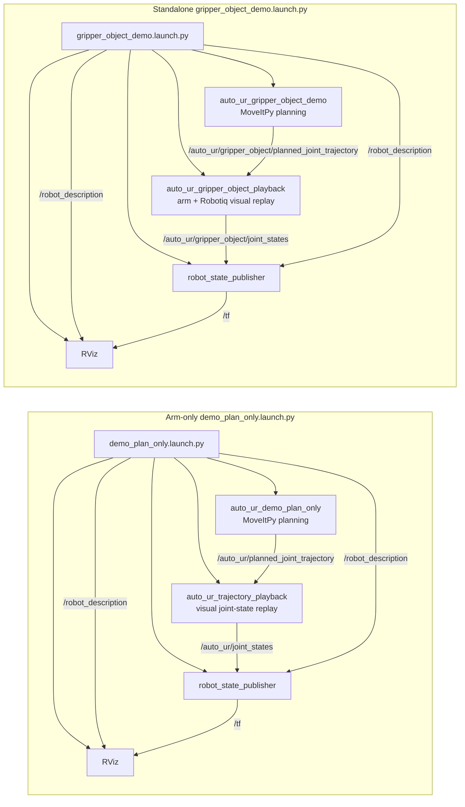

# auto_ur Structured Action Library Architecture

auto_ur is a ROS 2 Jazzy and MoveIt 2 package for plan-only UR-style
manipulation demos. The current library keeps the existing MoveItPy planning
backend, but wraps it in structured action contracts so future planners,
executors, or behavior-tree nodes can call reusable skills through a registry.

Hardware execution, global failure routing, LLM planning, TAMP, and full
behavior-tree execution are intentionally outside this package for now.

## Package Shape

The package is organized around a small layered action-library boundary:

- `core/` contains `ActionSpec`, `PrimitiveResult`, `SkillResult`,
  `RecoveryResult`, `Failure`, and `FailureType`.
- `world_model.py` contains a dictionary-backed symbolic world model for
  objects, locations, and robot state.
- `config/` contains `ConfigLoader` for YAML-backed robot, pose, safety, and
  demo settings.
- `primitives/` contains low-level robot and perception operations.
- `skills/` contains reusable manipulation skills with preconditions,
  execution, postconditions, and bounded local recovery hooks.
- `registry/` exposes available actions and instantiates skill classes from
  planner-style action dictionaries.
- `nodes/` contains runnable ROS demo entry points.

## Action Contracts

Primitives and skills return structured result objects instead of bare booleans.
The old `ActionResult` name remains as a compatibility alias for primitive-like
results, but new code should use the explicit result types.

`PrimitiveResult` is used by low-level calls such as motion planning, gripper
commands, perception, and reachability checks. It includes `success`,
`message`, optional `error_code`, optional `Failure`, debug `details`, and
symbolic `world_updates`.

`SkillResult` is used by reusable skills such as `PickObject` and
`PlaceObject`. It includes `success`, `message`, optional `Failure`, debug
`details`, and symbolic `world_updates`.

`RecoveryResult` is used only inside bounded local recovery. A failed recovery
does not decide what should happen globally; it reports the result to the
caller.

`FailureType` intentionally stays small and generic:
`POSE_UNKNOWN`, `LOW_CONFIDENCE`, `NOT_REACHABLE`, `PATH_BLOCKED`,
`GRASP_FAILED`, `PLACE_FAILED`, `DESTINATION_OCCUPIED`, `OBJECT_DROPPED`,
`SAFETY_VIOLATION`, and `UNKNOWN_FAILURE`.

## World Model

`WorldModel` stores the symbolic state needed by skills:

- objects with pose, confidence, state, reachability, and location fields
- locations with pose, confidence, clear, and reachable fields
- robot state with `holding`, `hand_empty`, and `gripper_ready`

Skills use helper methods such as `object_exists()`, `pose_known()`,
`confidence_above()`, `object_reachable()`, `location_reachable()`,
`location_clear()`, `hand_empty()`, `holding()`, `update_robot_holding()`, and
`update_object_location()`.

The world model is deliberately symbolic. It does not own ROS topics, MoveIt
state monitors, perception subscriptions, or hardware resources.

## Primitive Boundary

Primitives are the only layer that should talk directly to ROS 2, MoveIt 2,
perception systems, or gripper control.

The current motion primitives in `primitives/arm_motion.py` keep the existing
MoveItPy plan-only behavior:

- `move_to_named_pose(...)`
- `move_to_joint_state(...)`
- `move_to_pose(...)`
- `planned_state_from_trajectory(...)`

Additional primitive modules provide deterministic stubs for future robot
integration:

- `gripper.open_gripper()`
- `gripper.close_gripper()`
- `perception.detect_object()`
- `robot_motion.check_reachability()`
- `robot_motion.move_to_pose_stub()`

Future ROS 2 gripper actions, perception services, planning-scene checks, or
MoveIt reachability queries should be added behind these primitive interfaces,
not inside skills.

## Skill Boundary

Skills own manipulation logic and symbolic checks. They decide what needs to
happen, but not how ROS or MoveIt perform each low-level operation.

Every skill implements:

- `name`
- `parameters`
- `check_preconditions(world)`
- `execute(world)`
- `check_postconditions(world)`
- `local_recovery(world, failure)`
- `run(world)`

`run()` checks preconditions, executes, applies symbolic world updates, checks
postconditions, and attempts only bounded local recovery where the skill knows
how to do so.

`PickObject(object_id)` checks object existence, pose confidence, reachability,
hand state, and gripper readiness. It then plans/calls `pre_pick`, `pick`, close
gripper, and `lift`, and verifies that the robot is holding the object.

`PlaceObject(object_id, target_id)` checks that the object is held, target pose
is known, target is reachable, and target is clear. It then plans/calls
`pre_place`, `place`, open gripper, and `retreat`, and verifies that the object
is at the target and the hand is empty.

Local recovery is intentionally narrow:

- pose unknown or low confidence can trigger a perception rescan stub
- grasp failure can select an alternate grasp stub
- place failure can select an alternate placement pose stub
- unreachable objects and occupied destinations are reported for an external
  planner or executor to handle later

## Registry Boundary

`ActionRegistry` still stores action metadata and optional handlers for the
existing demo flow. It also registers skill classes and can instantiate them
from planner-style dictionaries:

```python
{
    "skill": "PickObject",
    "params": {"object_id": "specimen"},
}
```

```python
{
    "skill": "PlaceObject",
    "params": {"object_id": "specimen", "target_id": "target"},
}
```

The default registry currently exposes the existing primitive/demo handlers and
the class-based `PickObject` and `PlaceObject` skills.

## Plan-Only Safety Boundary

All motion primitives and skills call planning or deterministic stubs only.
They do not execute trajectories on hardware.

The demo proves that a UR10e MoveIt planning context can produce plans for the
configured joint and task-space goals, and that the structured skill layer can
chain symbolic pick/place actions. Hardware movement remains out of scope.

## RViz Demo Node Flow

The arm-only demo and the standalone gripper demo both use RViz as a plan-only
visualizer. Playback nodes convert planned trajectories into joint states only
for visualization; they are not hardware controllers.

The standalone gripper demo intentionally uses two robot descriptions: MoveItPy
receives the arm-only UR10e model for planning, while `robot_state_publisher`
and RViz receive the combined UR10e + Robotiq model for visualization. This
keeps visual gripper geometry from becoming a planning collision object in the
current plan-only demo.


