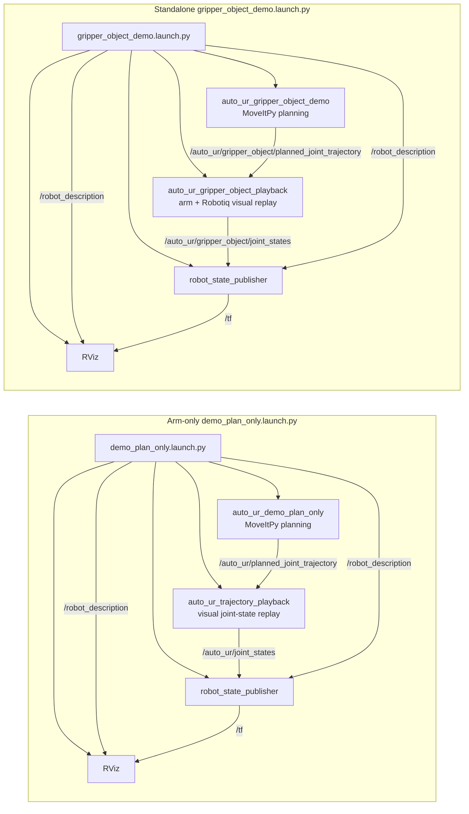

# auto_ur MoveIt-First Demo Architecture

auto_ur is currently a minimal ROS 2 Jazzy and MoveIt 2 demo package for UR10e
plan-only motion. The package uses MoveItPy directly so the first working demo
is easy to inspect and debug.

## Shape

The package keeps a small amount of structure:

- `core/` contains `ActionSpec` and `ActionResult` data contracts.
- `config/` contains `ConfigLoader` for YAML-backed robot, pose, safety, and
  demo settings.
- `primitives/` contains direct MoveItPy planning functions.
- `skills/` contains composed behaviors built from primitives.
- `registry/` lists available demo actions and their metadata.
- `nodes/` contains runnable ROS demo entry points.

There is no adapter layer and no abstract interface layer in this version.

## Motion Functions

The demo exposes three primitives through:

```python
from auto_ur import primitives as prims
```

`prims.move_to_named_pose(...)` loads a named UR10e joint state from YAML and
plans to it.

`prims.move_to_joint_state(...)` accepts explicit joint positions and plans a
joint-space trajectory.

`prims.move_to_pose(...)` accepts a task-space end-effector pose. MoveIt solves
inverse kinematics and plans a joint trajectory.

The `pick_and_place_demo(...)` skill chains task-space poses: `pre_pick`,
`pick`, `lift`, `pre_place`, `place`, and `retreat`. It does not use a gripper,
attach objects, or prove physical grasping.

## Plan-Only Safety Boundary

All primitive and skill functions call planning APIs only. They do not execute
trajectories and must not call `execute()`.

The demo proves that a UR10e MoveIt planning context can produce plans for the
configured joint and task-space goals. Hardware movement is intentionally out of
scope.

## RViz Demo Node Flow

The arm-only demo and the standalone gripper demo both use RViz as a
plan-only visualizer. Playback nodes convert planned trajectories into joint
states only for visualization; they are not hardware controllers.

The standalone gripper demo intentionally uses two robot descriptions:
MoveItPy receives the arm-only UR10e model for planning, while
`robot_state_publisher` and RViz receive the combined UR10e + Robotiq model for
visualization. This keeps visual gripper geometry from becoming a planning
collision object in the current plan-only demo.


