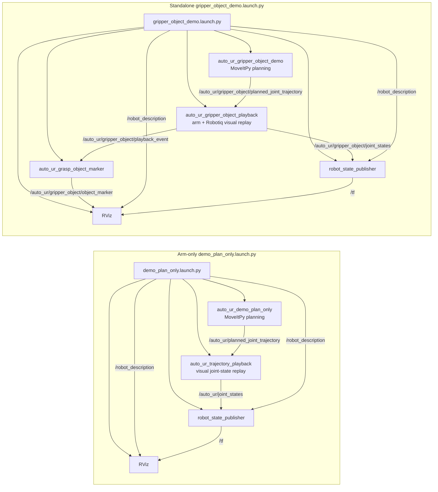

- Record each implementation session under a daily heading.
- Use daily headings in the form `Day of the week, Month Day`.
- Timestamp every session entry in `MM/DD hh:mm` local time.
- List concrete files changed, verification commands, and results.

# Stage 1 Implementation Plan And Log

## Friday, June 5

### 06/05 15:51

- Began the MoveIt-first UR10e redesign requested by the user.
- Replaced `auto_ur/configuration/` with `auto_ur/config/`.
- Removed the abstract `auto_ur/interfaces/` namespace.
- Removed `config/robots/ur3e.yaml` to keep the demo UR10e-only.
- Added MoveIt-first primitive, skill, registry, and demo node modules.
- Added UR10e named joint state, Cartesian pose, and demo sequence YAML.
- Rewrote `docs/architecture.md` for the simplified MoveIt-first architecture.
- Added `docs/demo_ur10e_plan_only.md` and
  `launch/demo_plan_only.launch.py`.

### 06/05 16:00

- Updated `package.xml` to restore direct MoveIt dependencies:
  `moveit_py`, `moveit_ros_planning_interface`, `geometry_msgs`, `launch`,
  `launch_ros`, `ament_index_python`, `python3-yaml`, and `rclpy`.
- Updated `setup.py` to install launch files, docs, demo YAML, pose YAML, robot
  YAML, and safety YAML.
- Added `auto_ur_demo_plan_only = auto_ur.nodes.demo_plan_only:main`.
- Replaced the Stage 1 scaffold test with MoveIt-first unit tests covering
  config loading, action data types, registry contents, fake primitive
  planning, fake pick/place planning, and no `.execute(` calls in primitives or
  skills.
- Ran focused WSL unit tests: `python3 -m pytest -q test/test_moveit_first_demo.py`.
  Result: 7 passed, 1 skipped.
- Ran WSL/ROS 2 Jazzy verification with the local MoveIt workspace sourced:
  `colcon build --packages-select auto_ur`, `colcon test --packages-select auto_ur`,
  and `colcon test-result --verbose`.
  Result: 11 tests, 0 errors, 0 failures, 2 skipped.

## Monday, June 8

### 06/08 10:23

- Investigated `ros2 launch auto_ur demo_plan_only.launch.py` startup failure.
- Launch reached the `auto_ur_demo_plan_only` node and MoveItPy initialization,
  then failed because `robot_description` was not provided by parameter or
  topic.
- Confirmed the newly added official Universal Robots description repo is
  present at `moveit_ws/src/Universal_Robots_ROS2_Description` and its ROS
  package name is `ur_description`.
- Confirmed `ur_description` provides URDF/xacro files for UR10e, but not a
  MoveIt SRDF or planning pipeline config.
- Updated `launch/demo_plan_only.launch.py` to generate `robot_description`
  from `ur_description/urdf/ur.urdf.xacro` with `ur_type:=ur10e`.
- Added minimal MoveIt config files under `config/moveit/`:
  `ur10e.srdf`, `kinematics.yaml`, `ompl_planning.yaml`, and `moveit_py.yaml`.
- Updated `setup.py` so `config/moveit/*` installs with the package.
- Updated `package.xml` to declare runtime dependencies on `ur_description`
  and `xacro`.
- Caveat: `ur_description` must be built and sourced in the same workspace
  before this launch can resolve `FindPackageShare('ur_description')`.

### 06/08 10:51

- Rebuilt `ur_description` and `auto_ur` in WSL, then verified the installed
  launch file contained the new parameter blocks.
- Reran `ros2 launch auto_ur demo_plan_only.launch.py`.
- Result: the original missing `robot_description` error was fixed; MoveIt
  loaded the UR10e robot model and KDL kinematics plugin.
- New startup blocker: no `/joint_states` publisher was running, so MoveIt
  could not establish a current robot state and aborted planning scene monitor
  setup.
- Updated `launch/demo_plan_only.launch.py` to start `joint_state_publisher`
  and `robot_state_publisher` with the same generated UR10e robot description.
- Updated `package.xml` to declare `joint_state_publisher` and
  `robot_state_publisher`.

### 06/08 10:54

- Reran the launch with `joint_state_publisher` and `robot_state_publisher`.
- Result: `robot_state_publisher` initialized, but `joint_state_publisher`
  waited for a `robot_description` topic and did not publish `/joint_states`
  before MoveIt's startup timeout.
- Replaced the generic `joint_state_publisher` launch entry with a small
  `auto_ur_fake_joint_state_publisher` console node that publishes the
  configured UR10e named `demo_start` joint state directly to `/joint_states`.
- Updated `setup.py` with the new console entry point.
- Updated `package.xml` to depend on `sensor_msgs` instead of
  `joint_state_publisher`.

### 06/08 11:05

- Fixed remaining MoveItPy startup/config issues found by repeated WSL launch
  verification:
  - Updated `config/moveit/ompl_planning.yaml` to use Jazzy's
    `planning_plugins` string-array shape.
  - Updated `auto_ur/nodes/demo_plan_only.py` to avoid assigning custom
    attributes to the bound `MoveItPy` object and to import `RobotState` before
    `get_robot_model()`.
  - Added `config/moveit/joint_limits.yaml` so time parameterization has UR10e
    velocity and acceleration limits.
  - Added `config/moveit/moveit_controllers.yaml` with a fake
    FollowJointTrajectory controller entry for plan-only MoveIt startup.
  - Increased `wait_for_initial_state_timeout` in
    `config/moveit/moveit_py.yaml` to make standalone startup less brittle.
  - Updated `launch/demo_plan_only.launch.py` to shut down the helper
    publishers when the demo node exits.
  - Updated `auto_ur/nodes/fake_joint_state_publisher.py` to handle normal
    launch shutdown without a traceback.
- Synced the edited files from the Windows checkout to the WSL workspace copy
  at `/home/celing-24-04/projects_ws/moveit_ws/src/auto_ur`.
- Ran WSL verification:
  `source /opt/ros/jazzy/setup.bash && colcon build --packages-select auto_ur`
  followed by
  `source install/setup.bash && timeout 40s ros2 launch auto_ur demo_plan_only.launch.py`.
- Result: build passed, launch exited with code 0, helper nodes exited cleanly,
  and all demo actions reported success:
  `move_to_named_pose`, `move_to_joint_state`, `move_to_pose`, and
  `pick_and_place_demo`.
- Remaining caveats: MoveIt still logs that no 3D sensor plugins are defined
  for octomap updates, warns that the planning volume was not specified, and
  emits a class-loader unload warning on shutdown. These did not prevent
  startup or plan-only success.

### 06/08 14:53

- Implemented the RViz animated plan-only demo path requested for video
  recording.
- Updated `launch/demo_plan_only.launch.py` with an `rviz:=true` launch
  argument, RViz node wiring, RViz-lifetime shutdown behavior, and the new
  `auto_ur_trajectory_playback` helper node.
- Added `auto_ur/nodes/trajectory_playback.py` to publish `/joint_states`,
  queue planned `JointTrajectory` messages, replay them at half speed, and
  hold one second between segments.
- Updated `auto_ur/nodes/demo_plan_only.py` to convert MoveItPy
  `RobotTrajectory` wrappers into ROS trajectory messages and publish them on
  `auto_ur/planned_joint_trajectory`.
- Updated `auto_ur/skills/pick_place_demo.py` so each pick/place segment keeps
  its trajectory for playback.
- Added `config/rviz/demo_plan_only.rviz` with a robot-only RViz layout.
- Updated `config/poses/named_cartesian_poses.yaml` to use a more readable
  top-down pick, lift, transfer, place, and retreat sequence.
- Updated `package.xml` with `rviz2` and `trajectory_msgs`.
- Updated `setup.py` to install RViz config and the playback console entry.
- Synced the edited files into the WSL source copy at
  `/home/celing-24-04/projects_ws/moveit_ws/src/auto_ur`.
- Ran WSL build:
  `source /opt/ros/jazzy/setup.bash && colcon build --packages-select auto_ur`.
  Result: passed.
- Ran WSL non-RViz regression:
  `source install/setup.bash && timeout 45s ros2 launch auto_ur demo_plan_only.launch.py`.
  Result: launch exited with code 0; all four demo actions reported success;
  planned trajectories were published and queued for playback.
- Ran WSL RViz smoke test:
  `source install/setup.bash && timeout 20s ros2 launch auto_ur demo_plan_only.launch.py rviz:=true`.
  Result: RViz started, OpenGL initialized, the demo planned successfully, and
  trajectories were published/queued. The command was stopped by the timeout
  because RViz mode intentionally stays alive for video recording.

### 06/08 15:10

- Addressed RViz follow-up issues from video review.
- Fixed playback snapping by rewriting each queued trajectory's first waypoint
  to the current visual joint state before replay. This prevents stale planned
  start states from pulling the visualization back toward the initial pose.
- Updated `config/rviz/demo_plan_only.rviz` to emphasize the UR visual model:
  RobotModel now loads from the `/robot_description` topic and TF axes are
  hidden by default.
- Synced the updates into the WSL source copy.
- Ran WSL build:
  `source /opt/ros/jazzy/setup.bash && colcon build --packages-select auto_ur`.
  Result: passed.
- Ran WSL non-RViz regression:
  `source install/setup.bash && timeout 45s ros2 launch auto_ur demo_plan_only.launch.py`.
  Result: launch exited with code 0; all plans succeeded; trajectories were
  published/queued.
- Ran WSL RViz smoke test:
  `source install/setup.bash && timeout 20s ros2 launch auto_ur demo_plan_only.launch.py rviz:=true`.
  Result: RViz started, OpenGL initialized, demo planning succeeded, and
  playback trajectories were queued. The timeout stopped RViz because the RViz
  path is intentionally kept alive for recording.
- The only verification warning at that time was the previous ROS package-name
  warning, which was addressed in the later rename session.

### 06/08 15:24

- Investigated the recurring RViz state glitch where the robot briefly snapped
  back toward the initial pose every half second or so.
- Identified the likely visualization risk as shared `/joint_states` traffic:
  `robot_state_publisher` was listening to the global topic, so any other
  publisher in the graph could briefly drive the visual model.
- Updated `auto_ur/nodes/trajectory_playback.py` to publish the animated state
  to both `/joint_states` for MoveItPy compatibility and
  `/auto_ur/joint_states` for isolated visualization.
- Updated `launch/demo_plan_only.launch.py` so `robot_state_publisher` remaps
  `joint_states` to `/auto_ur/joint_states`.
- Added `auto_ur/nodes/floor_marker_publisher.py`, a packaged console entry
  point, and a `visualization_msgs` dependency.
- Updated `config/rviz/demo_plan_only.rviz` to display the floor marker on
  `/auto_ur/floor_marker`.
- Synced the updates into the WSL source copy.
- Ran WSL build:
  `source install/setup.bash && colcon build --packages-select auto_ur`.
  Result: passed.
- Ran WSL non-RViz regression:
  `source install/setup.bash && timeout 45s ros2 launch auto_ur demo_plan_only.launch.py`.
  Result: launch exited with code 0; all demo plans succeeded; trajectories
  were published and queued.
- Ran WSL RViz smoke test:
  `source install/setup.bash && timeout 25s ros2 launch auto_ur demo_plan_only.launch.py rviz:=true`.
  Result: RViz, playback, robot_state_publisher, floor marker publisher, and
  the demo node started; RViz initialized OpenGL; all demo plans succeeded; all
  trajectories were queued. The command was stopped by timeout because RViz mode
  intentionally remains open for recording.

### 06/08 15:30

- Added readable trajectory labels to the RViz playback path.
- Updated `auto_ur/nodes/demo_plan_only.py` so each published trajectory is
  labeled with the action or pick/place segment, such as
  `move_to_pose:pre_pick`, `pick_and_place_demo:pick`, and
  `pick_and_place_demo:retreat`.
- Updated `auto_ur/nodes/trajectory_playback.py` to log `START trajectory: ...`
  and `END trajectory: ...` when playback actually begins and finishes each
  animated segment.
- Updated `auto_ur/nodes/floor_marker_publisher.py` to make the RViz floor a
  smaller dark gray square centered beneath `base_link`.
- Synced the updates into the WSL source copy.
- Ran WSL build:
  `source install/setup.bash && colcon build --packages-select auto_ur`.
  Result: passed.
- Ran WSL non-RViz regression:
  `source install/setup.bash && timeout 45s ros2 launch auto_ur demo_plan_only.launch.py`.
  Result: launch exited with code 0; labels were published and initial playback
  start/end logs appeared.
- Ran WSL RViz smoke test:
  `source install/setup.bash && timeout 35s ros2 launch auto_ur demo_plan_only.launch.py rviz:=true`.
  Result: RViz mode started the floor marker and logged each playback segment
  through `pick`, `lift`, `pre_place`, `place`, and `retreat` with matching
  START/END messages.

### 06/08 15:40

- Fixed pick/place sequence planning so each segment starts from the previous
  planned segment's final state instead of the live/rest state.
- Updated primitive planning functions in `auto_ur/primitives/arm_motion.py` to
  accept an optional `start_state`; they still default to
  `set_start_state_to_current_state()` for one-shot plans.
- Added `planned_state_from_trajectory()` to convert a planned trajectory's
  final waypoint into a MoveIt `RobotState` for the next plan.
- Updated `auto_ur/skills/pick_place_demo.py` to thread planned start/end
  states through `pre_pick`, `pick`, `lift`, `pre_place`, `place`, and
  `retreat`.
- Updated `auto_ur/nodes/demo_plan_only.py` to thread planned states through
  the top-level demo sequence as well.
- Synced the updates into the WSL source copy.
- Ran WSL focused tests:
  `source install/setup.bash && python3 -m pytest -q src/auto_ur/test/test_moveit_first_demo.py`.
  Result: 7 passed, 1 skipped.
- Ran WSL build:
  `source install/setup.bash && colcon build --packages-select auto_ur`.
  Result: passed.
- Ran WSL non-RViz regression:
  `source install/setup.bash && timeout 45s ros2 launch auto_ur demo_plan_only.launch.py`.
  Result: all demo plans succeeded; the pick/place sub-plans were generated from
  chained planned states.
- Ran WSL RViz smoke test:
  `source install/setup.bash && timeout 35s ros2 launch auto_ur demo_plan_only.launch.py rviz:=true`.
  Result: RViz mode planned and played the full labeled sequence through
  `retreat`; the command was stopped by timeout because RViz remains open for
  recording.

### 06/08 15:46

- Added a configurable playback hold between animated demo segments.
- Updated `auto_ur/nodes/trajectory_playback.py` with a `hold_duration`
  parameter and defaulted it to 2 seconds.
- Updated `launch/demo_plan_only.launch.py` to pass `hold_duration: 2.0` to the
  playback node.
- Synced the updates into the WSL source copy.
- Ran WSL build:
  `source install/setup.bash && colcon build --packages-select auto_ur`.
  Result: passed.
- Ran WSL RViz smoke test:
  `source install/setup.bash && timeout 28s ros2 launch auto_ur demo_plan_only.launch.py rviz:=true`.
  Result: playback accepted the new parameter and logs showed roughly 2 seconds
  between an `END trajectory` message and the next `START trajectory` message.

## Tuesday, June 9

### 06/09 09:55

- Implemented the standalone gripper/object RViz demo plan.
- Removed the custom floor marker from the arm-only RViz path.
- Added a combined UR10e + Robotiq 2F-85 xacro and end-effector config.
- Added standalone gripper/object demo, playback, and object marker nodes.
- Added `gripper_object_demo.launch.py` and `gripper_object_demo.rviz`.
- Updated package metadata for `robotiq_description`, `std_msgs`, xacro
  install rules, end-effector config install rules, and new console scripts.
- Updated `docs/architecture.md` with the ROS node interaction diagram.
- During launch verification, the first standalone attempt failed because
  MoveIt treated the Robotiq visual/collision geometry as part of the planning
  model and rejected the start state for gripper self-collisions. The standalone
  launch now gives MoveItPy the arm-only UR10e description while
  `robot_state_publisher` and RViz receive the combined UR10e + Robotiq
  description.



- Ran WSL xacro smoke:
  `source install/setup.bash && xacro src/auto_ur/urdf/ur10e_robotiq_2f_85.urdf.xacro ur_type:=ur10e name:=ur10e`.
  Result: generated URDF contained UR10e joints, `tool0`, and Robotiq links.
- Ran WSL build:
  `source install/setup.bash && colcon build --packages-select auto_ur`.
  Result: passed.
- Ran WSL standalone RViz smoke:
  `source install/setup.bash && timeout 45s ros2 launch auto_ur gripper_object_demo.launch.py`.
  Result: RViz/OpenGL started, the gripper/object demo planned successfully,
  all six segment trajectories were published, and playback logged through
  `gripper_object_demo:retreat`. The command ended by timeout because RViz
  remains open.
- Ran WSL arm-only regression:
  `source install/setup.bash && timeout 30s ros2 launch auto_ur demo_plan_only.launch.py rviz:=true`.
  Result: the existing arm-only demo planned and replayed successfully; no
  floor marker node was launched.
- Ran WSL focused tests:
  `source install/setup.bash && python3 -m pytest -q src/auto_ur/test/test_moveit_first_demo.py`.
  Result: 7 passed, 1 skipped.

### 06/09 10:35

- Fixed the standalone gripper/object RViz marker status issue by updating
  `auto_ur/nodes/grasp_object_marker.py`.
- The object marker now starts visible at the pick pose instead of publishing an
  initial hidden/delete state.
- The marker timestamp is set to zero time so RViz resolves the marker against
  the latest available TF transform.
- The marker continues to use `base_link` for pick/place and `tool0` while
  attached to the gripper.
- Removed the repeated initial `DELETE` marker behavior; the node now publishes
  a stable `ADD` marker every tick.
- Updated the marker node shutdown path to handle launch/timeout shutdown
  without an `ExternalShutdownException` traceback.
- Synced the Windows checkout to the WSL workspace copy and rebuilt:
  `source install/setup.bash && colcon build --packages-select auto_ur`.
  Result: passed.
- Ran WSL standalone RViz smoke:
  `source install/setup.bash && timeout 50s ros2 launch auto_ur gripper_object_demo.launch.py`.
  Result: RViz/OpenGL started, the object marker node started, the demo planned
  successfully, all six segment trajectories were published, and playback
  logged through `gripper_object_demo:retreat`. The command ended by timeout
  because RViz remains open.

### 06/09 10:55

- Removed the visual object marker path from the standalone gripper demo while
  keeping the UR10e + Robotiq planning and playback flow.
- Deleted `auto_ur/nodes/grasp_object_marker.py`.
- Removed the `auto_ur_grasp_object_marker` launch node from
  `launch/gripper_object_demo.launch.py`.
- Removed the RViz Marker display for
  `/auto_ur/gripper_object/object_marker` from
  `config/rviz/gripper_object_demo.rviz`.
- Removed the marker console entry point from `setup.py`.
- Removed the now-unused `visualization_msgs` package dependency.
- Updated `docs/architecture.md` so the current node diagram no longer shows
  the object marker node or topic.
- Synced the Windows checkout to the WSL workspace copy.
- Refreshed stale generated install artifacts with
  `rm -rf build/auto_ur install/auto_ur`, then rebuilt with
  `source install/setup.bash && colcon build --packages-select auto_ur`.
  Result: passed.
- Confirmed installed executables no longer include the removed marker or floor
  marker scripts:
  `source install/setup.bash && ros2 pkg executables auto_ur | sort`.
- Ran WSL standalone RViz smoke against the refreshed install:
  `source install/setup.bash && timeout 45s ros2 launch auto_ur gripper_object_demo.launch.py`.
  Result: launch started playback, `robot_state_publisher`, RViz, and the demo
  node only; no marker node started. The demo planned successfully, published
  all six segment trajectories, and playback logged through
  `gripper_object_demo:retreat`. The command ended by timeout because RViz
  remains open.
- Cleaned up user-facing gripper demo strings so the terminal no longer
  describes the sequence as an object visual demo.
- Rebuilt after the wording cleanup and ran:
  `source install/setup.bash && timeout 35s ros2 launch auto_ur gripper_object_demo.launch.py rviz:=false`.
  Result: launch exited with code 0 after the demo node completed; it started
  playback, `robot_state_publisher`, and the demo node only, then reported
  `Gripper visual sequence planned successfully`.

### 06/05 17:28

- Renamed the ROS package identity from the previous camel-case name to
  `auto_ur`.
- Renamed the Python package directory to `auto_ur/`.
- Renamed the console module to `auto_ur.py`.
- Renamed the ROS resource marker to `resource/auto_ur`.
- Updated package metadata and launch configuration in `package.xml`,
  `setup.py`, `setup.cfg`, and `launch/demo_plan_only.launch.py`.
- Updated imports, tests, docs, README, and package commands to use `auto_ur`.
- Updated the optional MoveIt smoke-test environment variable to
  `AUTO_UR_RUN_MOVEIT_TESTS`.
- Ran WSL focused unit tests:
  `python3 -m pytest -q test/test_moveit_first_demo.py`.
  Result: 7 passed, 1 skipped.
- Ran WSL/ROS 2 Jazzy verification with the local MoveIt workspace sourced:
  `colcon build --packages-select auto_ur`, `colcon test --packages-select auto_ur`,
  and `colcon test-result --verbose`.
  Result: 11 tests, 0 errors, 0 failures, 2 skipped.

## Initial Inspection

Current package state before Stage 1 changes:

```text
.
|-- auto_ur/
|   |-- __init__.py
|   `-- auto_ur.py
|-- resource/
|   `-- auto_ur
|-- test/
|   |-- test_copyright.py
|   |-- test_flake8.py
|   `-- test_pep257.py
|-- package.xml
|-- README.md
|-- setup.cfg
`-- setup.py
```

- Package name: `auto_ur`
- Build type: `ament_python`
- Existing Python modules: `auto_ur/__init__.py`, `auto_ur/auto_ur.py`
- Existing launch files: none
- Existing tests: generated copyright, flake8, and pep257 tests

## Conflicts Found

- `package.xml` declared `moveit_ros_planning_interface` even though Stage 1 is
  intended to be MoveIt-free.
- The package did not yet contain the requested architecture scaffold,
  configuration templates, or architecture documentation.

## Steps Taken

1. Created importable Stage 1 scaffold packages under `auto_ur/`.
2. Added skeleton `ActionSpec` and `ActionResult` data contracts.
3. Added placeholder `ActionRegistry` and `ConfigLoader` classes.
4. Added Stage 1 YAML templates for UR10e, UR3e, workcell, objects, and safety.
5. Added `docs/architecture.md` describing the intended layered architecture.
6. Added tests for imports and YAML template parsing.
7. Updated package metadata so Stage 1 remains MoveIt-free.
8. Updated packaging so documentation and configuration templates install with
   the package.
9. Ran host import verification for the new scaffold classes.
10. Ran WSL/ROS 2 Jazzy `colcon build --packages-select auto_ur`.
11. Ran WSL/ROS 2 Jazzy `colcon test --packages-select auto_ur` and
    `colcon test-result --verbose`.

## Verification Result

- Host Python import check: passed.
- WSL/ROS 2 Jazzy `colcon build`: passed.
- WSL/ROS 2 Jazzy `colcon test`: passed with 5 tests, 0 errors, 0 failures,
  and 1 skipped generated copyright test.
- `colcon` reports the existing package naming warning because `auto_ur` uses
  uppercase letters. The package name was preserved intentionally.

## Stage 2 Reminder

Stage 2 should introduce abstract interfaces and mock adapters only. It should
still avoid MoveIt and hardware execution.
